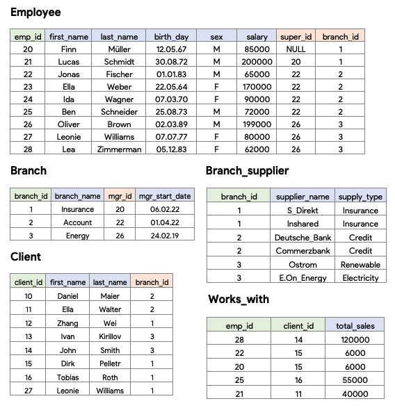
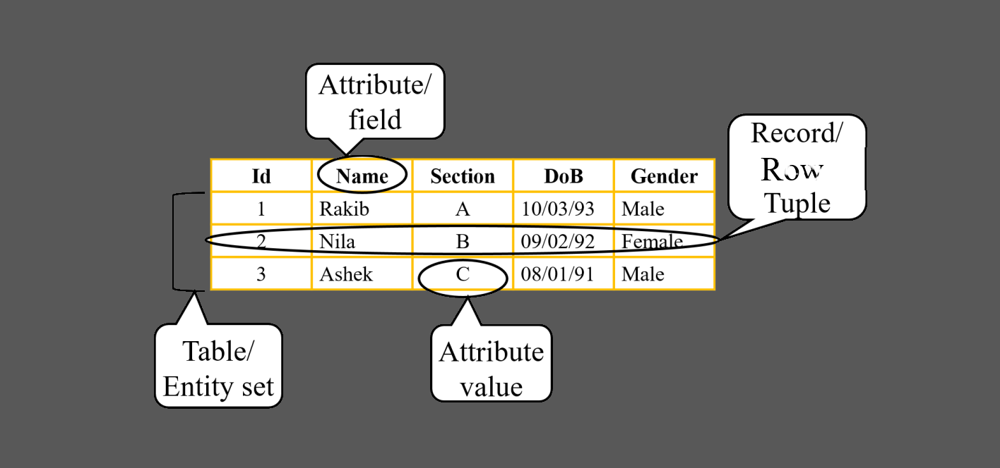
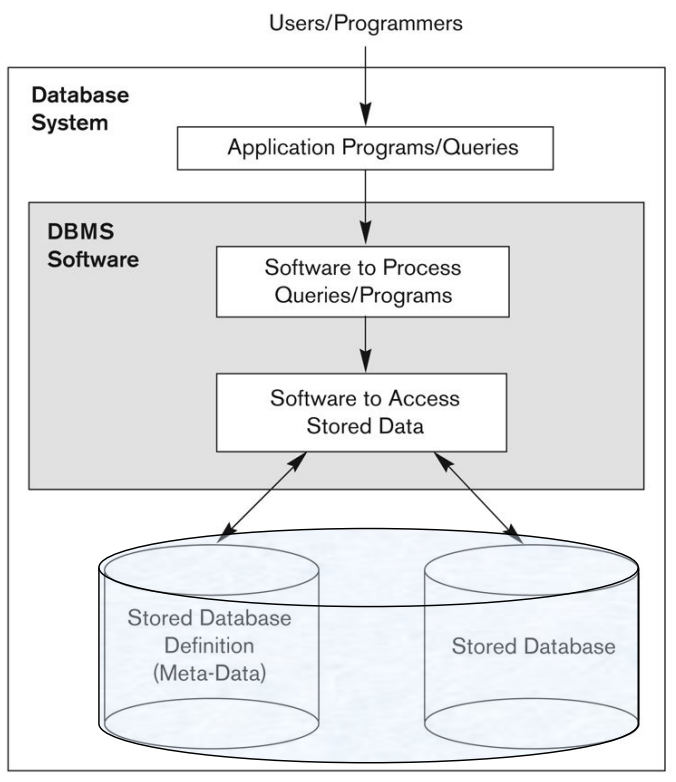
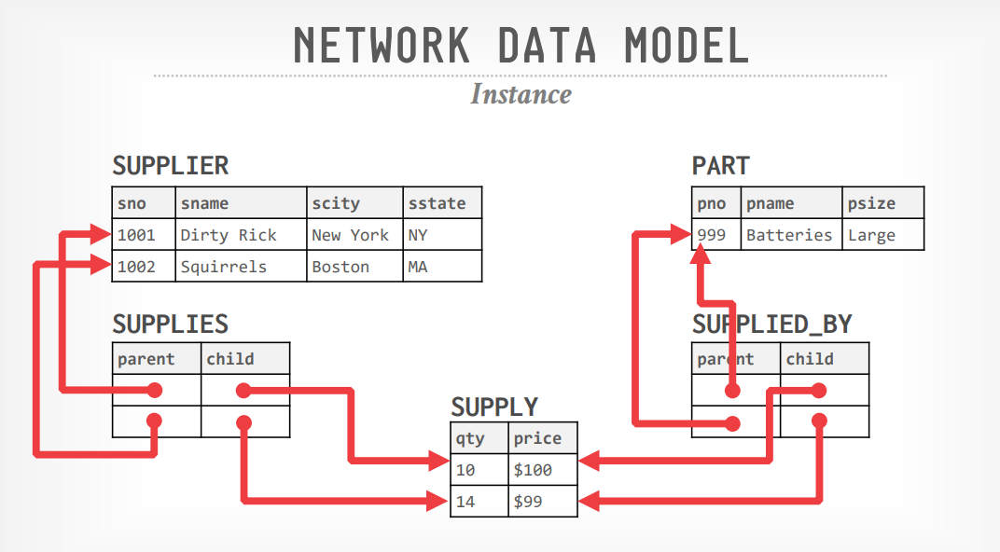
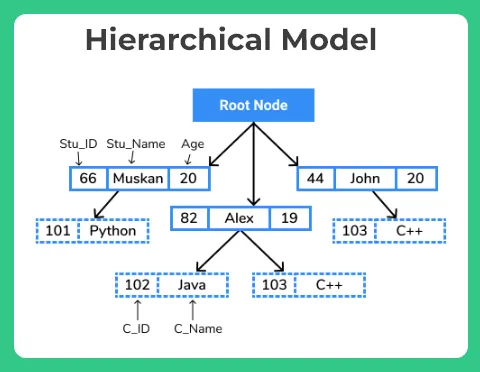
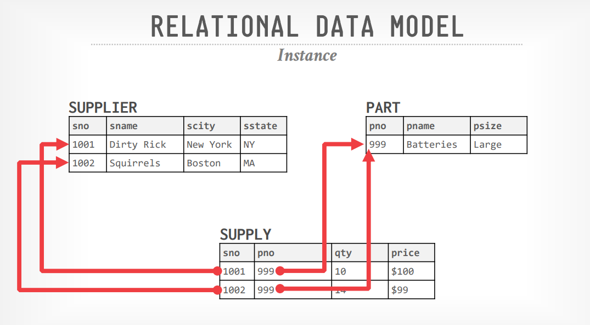

This repository contains all of my lecture contents of the course Database Systems.

------------------

**Table of Contents**

- [Course Overview](#course-overview)
  - [Tentative Marks Distribution](#tentative-marks-distribution)
  - [Consultaion](#consultaion)
- [Lecture 1](#lecture-1)
  - [Basic Definitions](#basic-definitions)
    - [Data](#data)
    - [Database](#database)
    - [Database Management System (DBMS)](#database-management-system-dbms)
    - [Database System](#database-system)
    - [Example Database](#example-database)
    - [Simplified Structure of a Database System](#simplified-structure-of-a-database-system)
  - [A Brief History](#a-brief-history)
    - [Timeline](#timeline)
  - [Faciliteis and Functionalities of DBMS](#faciliteis-and-functionalities-of-dbms)
- [Lecture 2](#lecture-2)
  - [Database Users](#database-users)
- [Lecture 3](#lecture-3)
  - [ER Diagram](#er-diagram)

# Course Overview
## Tentative Marks Distribution
| Marks Distribution     | %  |
| ---------------------- | -- |
| Assignments            | 5  |
| Quiz (Best 3 out of 4) | 10 |
| Midterm                | 20 |
| Final                  | 35 |
| Lab                    | 30 |

There is no marks for attendance this semester but you must attend at least 70% of the theory classes and 90% of the lab classes to be able to sit for the exam and that the policy will be strictly maintained.

## Consultaion
Email: ext.monirul.haque@bracu.ac.bd 
Timing Will be added after confirmation of my routine.

# Lecture 1
## Basic Definitions
### Data
Known facts that can be recorded and have an implicit meaning. 
Example: names, phone numbers, email addresses etc.
### Database
An organized collection of related data which is logically coherent and is built for a specific purpose. 
Example: USIS has a database which contains your ID, Phone Number, Email Address, Courses, Grades. 
### Database Management System (DBMS)
A software package/system to facilitate the creation, retrieval and maintenance of a computerized database.
Example: MySQL, Oracle, SQL Server, MongoDB, MariaDB etc. 
### Database System
The DBMS software together with the data itself. Sometimes, the applications are also included.

### Example Database

  
  

### Simplified Structure of a Database System

  

## A Brief History
Databases have been around for centuries, with record-keeping evolving from stone tablet engravings to file cabinets to digital storage. 

    
  <i>Fig: Ancient Sumerian medical prescription database</i>  
    
  <i>Fig: File cabinet system, a vintage solution for database system</i>

### Timeline
- **1950's:** In the early 1950's "file" system was invented and so was "File-Based Systems". File-based systems were an early attempt to computerize the manual file cabinet systems. The limitations were unhandled data dependencies, duplication of data, limited fixed queries, no security, only one user could access the database at a time. 

    
  <i>Fig: File-based Systems worked mainly on IBM 350 RAMAC Disk File. Storage Capacity 3.75MB</i>  

- **1960's:** The first database system was integrated Data Store (IDS), developed at General Electric (GE). They were the best home electronic appliances company but they soon sold their computer division to another company as their computer division was third best in the world. The IDS database system was based on a Network Data Model. 

    
  <i>Source: Professor Andy Pavlo's Slides</i>  

The Integrated Data Store (IDS) system, utilizing the network database model, enabled data access through multiple paths, enhancing query performance and flexibility. It eliminated data duplication by allowing records to be shared across multiple sets. However, IDS was complex, making it challenging to design, implement, and maintain. It required advanced technical skills to define records, sets, and navigate the network structure using pointers and links. Additionally, IDS lacked portability, making it difficult to transfer to different hardware, and it could not handle dynamic data evolution effectively.

Then came Information Management System (IMS) devloped at IBM following a hierarchical data model. 

    
  <i>Source: https://prepinsta.com/</i>  

The advantages the IMS database system had over IDS were that it was easier to understand and implement. It was easier to visualize. As it maintained a tree structure, data retrieval was faster. However, It was not flexible nor adaptive to data and it was expensive to change predefined hierarchy. It also had data duplications and redundancy. Trying to reduce data duplication lead to complex tree structures with multiple parents of a single child, which would make data retrieval slower.

- 1970's: Ted Codd, mathematician researcher at IBM, saw how programmers were wasting their time rewriting IMS or Codasyl (COBOL programmers standard for IDS) programs every time database structure or layout changed. He published a paper proposing Relational Model for Database.

    
  <i>Source: Professor Andy Pavlo's Slides</i>  

This approach eliminated almost all the problems the previous database systems had offering simplicity, data integrity, flexibility, and scalability. The data structure was logical and easy to understand. 
However, IBM didn't believe in this new approach because unlike others Ted Codd didn't implement it. It was just an idea. But Larry Ellison, a startup entrepreneur, found the idea interesting and implemented the first Relational Database Management System, Oracle, in 1977.

- **1980's:** In this era Relational Database Management System's were winning. IBM realized that they made a mistake and attempted to create Relational DBMS but failed twice. But they created a language called SEQUEL (Structured English QUEry Language) to manipulate and retrieve data stored in the relational model. SEQUEL sounded very close to QUEL which was used by the DBMS INGRES. So, the INGRES Corp. founder Stonebraker sued IBM. As a result, IBM was forced to changed the name to SQL (Structured Query Language). 
As their were so many relational DBMS were available that time, ISO called for all the query languges to standardize the best one. Stonebraker didn't like the governing body of the ISO, so he didn't submit. As a result, SQL became the standardized query language of all the Relational DBMS even though QUEL was better than SQL. Since then, the standard has been revised multiple times to include a larger set of features and incorporate common extensions making it better than QUEL gradually.
In this era Object Oriented Model was also introduced which was used in XML and JSON formats. Popular Database MongoDB follows this model.
- **1990's:** No major advancements in database systems happened in this era. Mycrosoft SQL Server and MySQL were created in this era.
- **2000's:** NoSQL Systems such as MongoDB became popular which made queries easier. 
- **2010's:** Graph Systems, Cloud System, Blockchain database... We are swimming in thousands of different database systems.

To learn more, check out Professor Pavlo's lecture https://www.youtube.com/watch?v=LWS8LEQAUVc&list=PLSE8ODhjZXjYzlLMbX3cR0sxWnRM7CLFn&index=1

## Faciliteis and Functionalities of DBMS
- A structured way to store and organize data in a logical and efficient manner.
- Efficient Data Manipulation (Insert, Update, Delete, Retrieve)
- Data Integrity Enforcement (Ensuring that data remains accurate, consistent, and reliable)
- Data Security (Control access to data and protect it from unauthorized access) 
- Concurrency Control (concurrent access to data by multiple users or applications, ensuring that data remains consistent and preventing conflicts or data corruption when multiple users try to modify the same data simultaneously.)
- Backup and Recovery
- Scalability and Performance

# Lecture 2
## Database Users
- **Actors On the Scene:** Those who actually use and control the database 
content, and those who design, develop and maintain database applications.
  - **Database administrators:** Responsible for authorizing access to the database, for coordinating and monitoring its use, acquiring software and hardware resources, controlling its use and monitoring efficiency of operations.
  - **Database designers:** Responsible to define the content, the structure, the constraints, and functions or transactions against the database. They must communicate with the end-users and understand their needs.
  - **Software Engineers:** Responsible for implementing the database and its associated applications using a dbms and other programming languages and tools.
  - **End-users:** They use the data for queries, reports and some of them update the database content.
- **Workers Behind the Scene:** Those who design and develop the DBMS 
software and related tools, and the computer systems operators. Example: The engineers who created and are maintaining MySQL, MongoDB etc.

# Lecture 3
## ER Diagram

<b>Example 1</b>  
We need to create a database schema design
based on the following (simplified) requirements
of the COMPANY Database:  
- The company is organized into DEPARTMENTs.Each department has a name, number and an empyloyee who manages the deppartment. We keep track of the start date of the department manager.
- A department may have several locations. Each department Each department controls controls a number of a number of PROJECTs. Each project has a unique name, unique number and is located at a single location.
- We store each EMPLOYEE’s social security number, address, salary, sex, and birthdate.
  - Each employee works for one department but may
work on work on several projects several projects.
  - We keep track of the number of hours per week that an employee currently works on each project.
  - We also keep track of the direct supervisor of each employee.
- Each employee may Each employee may have a number of a number of DEPENDENTs. For each dependent, we keep track of their name, sex birthdate and relationship to the employee

 

  

<b>Example 2</b>  
We now present another example, a UNIVERSITY database, to illustrate the ER 
modeling concepts. Suppose that a database is needed to keep track of student 
enrollments in classes and students’ final grades. After analyzing the miniworld 
rules and the users’ needs, the requirements for this database were determined to be 
as follows:  
<ul>
<li> The university is organized into colleges (COLLEGE), and each college has a unique name (CName), a main office (COffice) and phone (CPhone), and a particular faculty member who is dean of the college. Each college administers a number of academic departments (DEPT). Each department has a unique name (DName), a unique code number (DCode), a main office (DOffice) and phone (DPhone), and a particular faculty member who chairs the department. We keep track of the start date (CStartDate) when that faculty member began chairing the department.
<li> A department offers a number of courses (COURSE), each of which has a unique course name (CoName), a unique code number (CCode), a course level (Level: this can be coded as 1 for freshman level, 2 for sophomore, 3 for junior, 4 for senior, 5 for MS level, and 6 for PhD level), a course credit hours (Credits), and a course description (CDesc). The database also keeps track of instructors (INSTRUCTOR); and each instructor has a unique identifier (Id), name (IName), office (IOffice), phone (IPhone), and rank (Rank); 
in addition, each instructor works for one primary academic department.
<li> The database will keep student data (STUDENT) and stores each student’s name (SName, composed of first name (FName), middle name (MName), last name (LName)), student id (Sid, unique for every student), address 
(Addr), phone (Phone), major code (Major), and date of birth (DoB). A student is assigned to one primary academic department. It is required to keep track of the student’s grades in each section the student has completed.
<li> Courses are offered as sections (SECTION). Each section is related to a single course and a single instructor and has a unique section identifier (SecId). A section also has a section number (SecNo: this is coded as 1, 2, 3, . . . for multiple sections offered during the same semester/year), semester (Sem), year (Year), classroom (CRoom: this is coded as a combination of building code (Bldg) and room number (RoomNo) within the building), and days/times (DaysTime: for example, ‘MWF 9am-9.50am’ or ‘TR 3.30pm-5.20pm’—restricted to only allowed days/time values). (Note: The database will keep track of all the sections offered for the past several years, in addition to the current offerings. The SecId is unique for all sections, not just the sections for a particular semester.) The database keeps track of the students in each section, and the grade is recorded when available (this is a many-to-many relationship between students and sections). A section must have at least five students.
</ul>

 

  

<b>Example 3</b>  
Consider the following requirements for an airline reservation system.  
<ul>
<li> The database represents each AIRPORT, keeping its unique AirportCode, the AIRPORT Name, and the City and State in which the AIRPORT is located.
<li> Each airline FLIGHT has a unique number, the Airline for the FLIGHT, and the Weekdays on which the FLIGHT is scheduled (for example, every day of the week except Sunday can be coded as X7).
<li> A FLIGHT is composed of one or more FLIGHT LEGs (for example, flight number
CO1223 from New York to Los Angeles may have two FLIGHT LEGs: leg 1 from New York to
Houston and leg 2 from Houston to Los Angeles). Each FLIGHT LEG has a DEPARTURE AIRPORT
and Scheduled Departure Time, and an ARRIVAL AIRPORT and Scheduled Arrival Time.
<li> A LEG INSTANCE is an instance of a FLIGHT LEG on a specific Date (for example, CO1223 leg 1 on July 30, 1989). The actual Departure and Arrival AIRPORTs and
Times are recorded for each flight leg after the flight leg has been concluded. The
Number of available seats and the AIRPLANE used in the LEG INSTANCE are also kept.
<li> The customer RESERVATIONs on each LEG INSTANCE include the Customer Name, Phone,
and Seat Number(s) for each reservation.
<li> Information on AIRPLANEs and AIRPLANE TYPEs are also kept. For each AIRPLANE
TYPE (for example, DC-10), the TypeName, manufacturing Company, and Maximum Number of Seats are kept. The AIRPORTs in which planes of this type CAN LAND are kept in the database. For each AIRPLANE, the AirplaneId, Total number of seats,
and TYPE are kept.
</ul>

 

  

