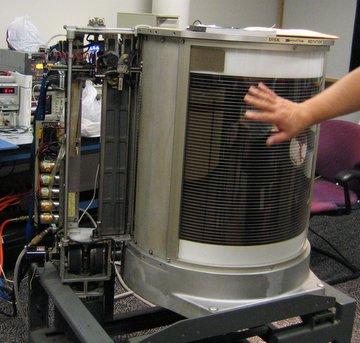

This repository contains all of my lecture contents of the course Database Systems.

------------------

**Table of Contents**


- [Course Overview](#course-overview)
  - [Tentative Marks Distribution](#tentative-marks-distribution)
  - [Consultaion](#consultaion)
- [Lecture 1](#lecture-1)
  - [Basic Definitions](#basic-definitions)
    - [Data](#data)
    - [Database](#database)
    - [Database Management System (DBMS)](#database-management-system-dbms)
    - [Database System](#database-system)
    - [Example Database](#example-database)
    - [Simplified Structure of a Database System](#simplified-structure-of-a-database-system)
  - [A Brief History](#a-brief-history)
    - [Timeline](#timeline)
  - [Faciliteis and Functionalities of DBMS](#faciliteis-and-functionalities-of-dbms)
- [Lecture 2](#lecture-2)
  - [Database Users](#database-users)
  - [When not to use a DBMS](#when-not-to-use-a-dbms)
  - [Data Models](#data-models)
  - [Database Schema vs Database State](#database-schema-vs-database-state)
  - [Three Schema Architecture](#three-schema-architecture)
    - [Internal Schema](#internal-schema)
    - [Conceptual Schema](#conceptual-schema)
    - [External Schema](#external-schema)
  - [Data Independence](#data-independence)
    - [Logical Data Independence](#logical-data-independence)
    - [Physical Data Independence](#physical-data-independence)
  - [DBMS Languages](#dbms-languages)
    - [Data Definition Language (DDL)](#data-definition-language-ddl)
      - [CREATE Command](#create-command)
      - [DROP Command](#drop-command)
      - [ALTER Command](#alter-command)
      - [TRUNCATE Command](#truncate-command)
    - [Data Manipulation Language (DML)](#data-manipulation-language-dml)
      - [SELECT Command](#select-command)
      - [INSERT Command](#insert-command)
      - [UPDATE Command](#update-command)
      - [DELETE Command](#delete-command)
    - [Data Control Language (DCL)](#data-control-language-dcl)
    - [Transaction Control Language (TCL)](#transaction-control-language-tcl)
- [Lecture 3](#lecture-3)
  - [Relational Data Models](#relational-data-models)
    - [Table / Entity Set / Entity Type](#table--entity-set--entity-type)
    - [Attributes / Fields](#attributes--fields)
      - [Key attributes](#key-attributes)
        - [Primary Key](#primary-key)
        - [Foreign Key](#foreign-key)
        - [Primary Key vs Foreign Key](#primary-key-vs-foreign-key)
    - [Attribute value / Column value / Data element / Unit of data](#attribute-value--column-value--data-element--unit-of-data)
    - [Records / Rows / Entities](#records--rows--entities)
    - [Data types](#data-types)
  - [Software Development Stages](#software-development-stages)
  - [ER (Entity Relationship) Diagram](#er-entity-relationship-diagram)
    - [Entities](#entities)
    - [Attributes](#attributes)
      - [Composite Attribute](#composite-attribute)
      - [Multi-valued Attribute](#multi-valued-attribute)
      - [Derived Attribute](#derived-attribute)
      - [Key Attribute](#key-attribute)
    - [Relationships](#relationships)
      - [Relationship Types](#relationship-types)
        - [One to One](#one-to-one)
        - [One to Many](#one-to-many)
        - [Many to One](#many-to-one)
        - [Many to Many](#many-to-many)
      - [Participation Constraints](#participation-constraints)
        - [Total Participation / Mandatory Participation / Existence Dependency](#total-participation--mandatory-participation--existence-dependency)
        - [Partial Participation / Optional Participation](#partial-participation--optional-participation)
    - [Weak Entity Types](#weak-entity-types)
    - [UML Class Diagrams](#uml-class-diagrams)
    - [ER Diagram Examples](#er-diagram-examples)
- [References](#references)

# Course Overview
## Tentative Marks Distribution
| Marks Distribution     | %  |
| ---------------------- | -- |
| Assignments            | 5  |
| Quiz (Best 3 out of 4) | 10 |
| Midterm                | 20 |
| Final                  | 35 |
| Lab                    | 30 |

There is no marks for attendance this semester but you must attend at least 70% of the theory classes and 90% of the lab classes to be able to sit for the exam and that the policy will be strictly maintained.

## Consultaion
Email: ext.monirul.haque@bracu.ac.bd 


# Lecture 1
## Basic Definitions
### Data
Known facts that can be recorded and have an implicit meaning. 
Example: names, phone numbers, email addresses etc.
### Database
An organized collection of related data which is logically coherent and is built for a specific purpose. 
Example: USIS has a database which contains your ID, Phone Number, Email Address, Courses, Grades. 
### Database Management System (DBMS)
A software package/system to facilitate the creation, retrieval and maintenance of a computerized database.
Example: MySQL, Oracle, SQL Server, MongoDB, MariaDB etc. 
### Database System
The DBMS software together with the data itself. Sometimes, the applications are also included.

### Example Database
<p align = "center">
  
  
</p>

### Simplified Structure of a Database System
<p align = "center">
  
</p>

## A Brief History
Databases have been around for centuries, with record-keeping evolving from stone tablet engravings to file cabinets to digital storage. 
<p align = "center">
   </br>
  <i>Fig: Ancient Sumerian medical prescription database</i> </br>
   </br>
  <i>Fig: File cabinet system, a vintage solution for database system</i>
</p>

### Timeline
- **1950's:** In the early 1950's "file" system was invented and so was "File-Based Systems". File-based systems were an early attempt to computerize the manual file cabinet systems. The limitations were unhandled data dependencies, duplication of data, limited fixed queries, no security, only one user could access the database at a time. 
<p align = "center">
   </br>
  <i>Fig: File-based Systems worked mainly on IBM 350 RAMAC Disk File. Storage Capacity 3.75MB</i> </br>
</p>

- **1960's:** The first database system was integrated Data Store (IDS), developed at General Electric (GE). They were the best home electronic appliances company but they soon sold their computer division to another company as their computer division was third best in the world. The IDS database system was based on a Network Data Model. 
<p align = "center">
   </br>
  <i>Source: Professor Andy Pavlo's Slides</i> </br>
</p>
The Integrated Data Store (IDS) system, utilizing the network database model, enabled data access through multiple paths, enhancing query performance and flexibility. It eliminated data duplication by allowing records to be shared across multiple sets. However, IDS was complex, making it challenging to design, implement, and maintain. It required advanced technical skills to define records, sets, and navigate the network structure using pointers and links. Additionally, IDS lacked portability, making it difficult to transfer to different hardware, and it could not handle dynamic data evolution effectively.

Then came Information Management System (IMS) devloped at IBM following a hierarchical data model. 

<p align = "center">
   </br>
  <i>Source: https://prepinsta.com/</i> </br>
</p>

The advantages the IMS database system had over IDS were that it was easier to understand and implement. It was easier to visualize. As it maintained a tree structure, data retrieval was faster. However, It was not flexible nor adaptive to data and it was expensive to change predefined hierarchy. It also had data duplications and redundancy. Trying to reduce data duplication lead to complex tree structures with multiple parents of a single child, which would make data retrieval slower.

- 1970's: Ted Codd, mathematician researcher at IBM, saw how programmers were wasting their time rewriting IMS or Codasyl (COBOL programmers standard for IDS) programs every time database structure or layout changed. He published a paper proposing Relational Model for Database.

<p align = "center">
   </br>
  <i>Source: Professor Andy Pavlo's Slides</i> </br>
</p>

This approach eliminated almost all the problems the previous database systems had offering simplicity, data integrity, flexibility, and scalability. The data structure was logical and easy to understand. 
However, IBM didn't believe in this new approach because unlike others Ted Codd didn't implement it. It was just an idea. But Larry Ellison, a startup entrepreneur, found the idea interesting and implemented the first Relational Database Management System, Oracle, in 1977.

- **1980's:** In this era Relational Database Management System's were winning. IBM realized that they made a mistake and attempted to create Relational DBMS but failed twice. But they created a language called SEQUEL (Structured English QUEry Language) to manipulate and retrieve data stored in the relational model. SEQUEL sounded very close to QUEL which was used by the DBMS INGRES. So, the INGRES Corp. founder Stonebraker sued IBM. As a result, IBM was forced to changed the name to SQL (Structured Query Language). 
As their were so many relational DBMS were available that time, ISO called for all the query languges to standardize the best one. Stonebraker didn't like the governing body of the ISO, so he didn't submit. As a result, SQL became the standardized query language of all the Relational DBMS even though QUEL was better than SQL. Since then, the standard has been revised multiple times to include a larger set of features and incorporate common extensions making it better than QUEL gradually.
In this era Object Oriented Model was also introduced which was used in XML and JSON formats. Popular Database MongoDB follows this model.
- **1990's:** No major advancements in database systems happened in this era. Mycrosoft SQL Server and MySQL were created in this era.
- **2000's:** NoSQL Systems such as MongoDB became popular which made queries easier. 
- **2010's:** Graph Systems, Cloud System, Blockchain database... We are swimming in thousands of different database systems.

To learn more, check out Professor Pavlo's lecture https://www.youtube.com/watch?v=LWS8LEQAUVc&list=PLSE8ODhjZXjYzlLMbX3cR0sxWnRM7CLFn&index=1

## Faciliteis and Functionalities of DBMS
- A structured way to store and organize data in a logical and efficient manner.
- Efficient Data Manipulation (Insert, Update, Delete, Retrieve)
- Data Integrity Enforcement (Ensuring that data remains accurate, consistent, and reliable)
- Data Security (Control access to data and protect it from unauthorized access) 
- Concurrency Control (concurrent access to data by multiple users or applications, ensuring that data remains consistent and preventing conflicts or data corruption when multiple users try to modify the same data simultaneously.)
- Backup and Recovery
- Scalability and Performance (Can keep good performance even if the database becomes large)

</br></br>

# Lecture 2
## Database Users
- **Actors On the Scene:** Those who actually use and control the database 
content, and those who design, develop and maintain database applications.
  - **Database administrators:** Responsible for authorizing access to the database, for coordinating and monitoring its use, acquiring software and hardware resources, controlling its use and monitoring efficiency of operations.
  - **Database designers:** Responsible to define the content, the structure, the constraints, and functions or transactions against the database. They must communicate with the end-users and understand their needs.
  - **Software Engineers:** Responsible for implementing the database and its associated applications using a dbms and other programming languages and tools.
  - **End-users:** They use the data for queries, reports and some of them update the database content.
- **Workers Behind the Scene:** Those who design and develop the DBMS 
software and related tools, and the computer systems operators. Example: The engineers who created and are maintaining MySQL, MongoDB etc.

## When not to use a DBMS
- Hardware/Security/Service of that DBMS costs more than the available budget. Example: We don't need to buy Improvado DBMS  with 2000 dollar per month when we just need a DBMS for a local e-commerce website. In that case, we can just use free DBMS like MongoDB or MySQL.
- Database is well defined, no further changes are expected and multiple user access not required.
- For temporary/short-lived data.
- In resource-constrained environments like embedded systems or IoT devices. Example: AC, projector, calculator etc.
- When the data complexity exceeds the DBMS's modeling capabilities. Example: Google Maps can not be stored in MySQL database, it's stored in a graph DBMS.
- When the data needs to be updated and accessed real time, meaning that the database stores data in JSON files which is synchronized in real-time to every client that is connected to the database. In that case we can not use relational databases like MySQL, we might have to rely on NoSQL languages such as MongoDB, Firebase etc. But the cost will be higher.
- If the database system is not able to handle the complexity of data because of modeling limitations. For example, complex genome and protein structures can not be stored in MySQL

## Data Models
A set of concepts to describe the structure of a database, the operations for manipulating these structures, and certain constraints that the database should obey.
* **Conceptual (high-level, semantic) data models**: 
These Provide concepts that are close to the way many users perceive data, meaning that these data models don't go into too much detail. These are abstract representations of the important entities/objects, attributes and relationships of the whole database. So, sometimes these are also called entity-based or object-based data models.
* **Physical (low-level, internal) data models**:
These provide concepts that describe details of how data is stored in the computer hardware(HDD/SSD/RAM) in that database system. 
* **Implementation (representational) data models**:
This type of data model is used to represent the logical part of the database. It's neither low-detailed/abstract as conceptual data models nor as detailed as the physical data models to show structure of the database on hardware. 
* **Self-Describing Data Models**:
These models combine the description of data with the data values. Example: MongoDB (the data is stored in objects that look like python dictionaries). 

## Database Schema vs Database State

| Database Schema    | Database State   |
| ---------------------- | ---------------------- |
| The description of a database including structure, data type and constraints | Snapshot of the database in a particular moment  |
| It is not changed frequently | It changes after every insertion, update and delete in the database |
|  |  |

## Three Schema Architecture
<p align="center">
  
</p>

### Internal Schema
Internal schema at the internal level to describe physical storage structures and access paths (e.g indexes). Typically uses a physical data model.
<p align="center">
  
</p>

### Conceptual Schema

Conceptual schema at the conceptual level to describe the structure and constraints for the whole database for a community of users. Typically uses a conceptual or an implementation data model.

<p align="center">
  
</p>

### External Schema

External schemas at the external level to describe the various user views. It uses a conceptual data model.


<p align="center">
  
</p>

Examples source: https://www.javatpoint.com/dbms-three-schema-architecture

## Data Independence
Data Independence is the ability to change the schema at one level without impacting the schema at the next higher level. 
### Logical Data Independence
■ The capacity to change the conceptual schema without having to 
change the external schemas and their associated application 
programs.
■ Example: adding a new column that is not shown in the app or 
changing the datatype which does not change the external view.
### Physical Data Independence
■ The capacity to change the internal schema without having to 
change the conceptual schema.
■ For example, the internal schema may be changed when certain 
file structures are reorganized or new indexes are created to 
improve database performance
## DBMS Languages
DBMS Language Commands can be grouped into different categories. 
### Data Definition Language (DDL)
The SQL DDL category provides commands for defining, deleting and modifying tables in a database. We use the following commands in this category.
#### CREATE Command
To create the database or tables inside the database.
```SQL
CREATE TABLE table_name (column_name1 datatype(size), column_name2 datatype(size), column_name3 datatype(size));
```
#### DROP Command
To delete a database or a table inside the database. 
```SQL
DROP TABLE table_name; 
```
#### ALTER Command
To change the structure of the tables in the database such as changing the name of a table, adding a primary key to a table, or adding or deleting a column in a table.

```SQL
--Syntax to add a column into a table
ALTER TABLE table_name ADD (column_name datatype(size));
--Syntax to add a primary key to a table
ALTER TABLE table_name ADD primary key (column_name);
```
#### TRUNCATE Command
To remove all records from a table, which will empty the table but not delete the table itself. 
```SQL
TRUNCATE TABLE table_name;
```
### Data Manipulation Language (DML)
The SQL DML commands provide the ability to query, delete and update data in the database.  Use the following commands in this category.
#### SELECT Command
To retrieve data from tables in the database. 
```SQL
SELECT * FROM table_name;
```
#### INSERT Command
To add records of data into an existing table. 
```SQL
INSERT INTO table_name (column1, column2, column3) VALUES (value1, value2, value3);
```
#### UPDATE Command
To modify or update data contained within a table in the database. 
```SQL
UPDATE table_name SET column1 = value1, column2 = value2 WHERE condition;
```
#### DELETE Command
To delete data from a table in the database.
```SQL
DELETE FROM table_name WHERE condition;
```
### Data Control Language (DCL)
You use DCL to deal with the rights and permissions of users of a database system. You can execute SQL commands to perform different types of operations such as create and drop tables. To do this, you need to have user rights set up. This is called user privileges. This category deals with advanced functions or operations in the database. Note that this category can have a generic description of the two main commands. Use the following commands in this category:

**GRANT** Command to provide the user of the database with the privileges required to allow users to access and manipulate the database.

**REVOKE** Command to remove permissions from any user.
### Transaction Control Language (TCL)
The TCL commands are used to manage transactions in the database. These are used to manage the changes made to the data in a table by utilizing the DML commands. It also allows SQL statements to be grouped together into logical transactions. This category deals with advanced functions or operations in a database. Note that this category can have a generic description of the two main commands. Use the following commands in this category:

**COMMIT** Command to save all the work you have already done in the database. 

**ROLLBACK** Command to restore a database to the last committed state.
</br>

</br></br>

# Lecture 3
## Relational Data Models
The relational model represents how data is stored in Relational Databases using multiple tables with their relations to each other.

<p align="center">
  
</p>

<p align="center">
  
</p>

### Table / Entity Set / Entity Type
A table contains all the fields, attributes and records for a type of entity. A database will most probably contain more than one table.

### Attributes / Fields
Column headings are known as fields. Each field contains a different attribute. For every table, a unit of data is entered into each field.

#### Key attributes
Attributes that are distinct for each entity in the table are called Key attributes.
##### Primary Key
A primary key is a special attribute or field within a database table that uniquely identifies each record or row in that table. It acts as a distinctive label for every information stored in the table, ensuring that no two records have the same identifier. This unique identification helps locate, access, and manipulate specific data within the table.

##### Foreign Key
Tables in a relational database do not stay isolated from each other. They need to have relationships between them. Tables are linked with one another through a key column (the primary key) of one table that’s also present in the related table as a foreign key.

##### Primary Key vs Foreign Key
| Basis           | Primary Key                                                                                         | Foreign Key                                                                                               |
| --------------- | --------------------------------------------------------------------------------------------------- | --------------------------------------------------------------------------------------------------------- |
| Definition      | A primary key is a unique identifier for each record in a table.                                    | A foreign key establishes a relationship between tables by referencing the primary key of another table.  |
| Basic           | Ensures uniqueness and data integrity within a single table.                                        | Establishes relationships and maintains referential integrity between tables.                             |
| NULL            | Does not allow NULL values in the primary key field.                                                | Allows NULL values in the foreign key field, indicating a missing or unspecified relationship.            |
| Count           | Only one primary key can exist per table.                                                           | Multiple foreign keys can exist within a table, depending on the relationships with other tables.         |
| Duplication     | No duplicate primary key values are allowed within the table.                                       | Can contain duplicate foreign key values, reflecting multiple records associated with the same reference. |
| Indexing        | Primary keys are automatically indexed to enhance data retrieval speed.                             | Foreign keys can be indexed but are not automatically indexed.                                            |
| Deletion        | Deleting a record with a primary key constraint can affect referential integrity in related tables. | Deleting a record with a foreign key constraint can be restricted or cascade to maintain integrity.       |
| Insertion       | Each new record must have a unique primary key value assigned.                                      | The foreign key can reference an existing primary key value or be NULL if the relationship is optional.   |
| Temporary table | Primary keys can be applied to temporary tables.                                                    | Foreign keys can also be applied to temporary tables to establish relationships.                          |
| Relationship    | Primary keys define the basis for establishing relationships with other tables.                     | Foreign keys establish relationships and connect data between related tables.                             |

### Attribute value / Column value / Data element / Unit of data
Each individual piece of data entered into a column is a unit of data. These units are also called data elements or column values.

### Records / Rows / Entities
A record consists of a collection of data for each entity. It’s also known as a row in the table.


### Data types
To keep the data consistent from one record to the next, an appropriate data type is assigned to each column. The data type of a column determines what type of data can be stored in each column.</br>
Data types are also a way of classifying data values or column values. Different kinds of data values or column values require different amounts of memory to store them. Different operations can be performed on those column values based on their datatypes. </br>

Some common data types used in databases are: </br>

**Numeric data types** such as INT, TINYINT, BIGINT, FLOAT and REAL. </br>

**Date and time data types** such as DATE, TIME and DATETIME. </br>

**Character and string data types** such as CHAR and VARCHAR. </br>

**Binary data types** such as BINARY and VARBINARY. </br>

And miscellaneous data types such as: </br>

Character Large Object (CLOB), for storing a large block of text in some form of text encoding.  </br>
Binary Large Object (BLOB), for storing a collection of binary data such as images. </br>

## Software Development Stages
<p align="center">
  
</p>

The database design process involves the following steps: </br>
- Requirements collection and analysis, where designers interview users to understand their data needs and functional requirements. 
- Conceptual design, where a high-level conceptual schema is created using a conceptual data model, describing entity types, relationships, and constraints. 
- Logical design, where the conceptual schema is transformed into the implementation data model of the chosen DBMS. 
- Physical design, where internal storage structures, file organizations, indexes, and access paths are specified. </br>
Throughout this process, application programs are designed and implemented as database transactions corresponding to the specified functional requirements.

## ER (Entity Relationship) Diagram 
It is a high-level Conceptual Data Model. This model is used to visualize the data elements and relationship among them for a specified system. </br>

The ER model describes data as entities, relationships, and attributes.


### Entities
The basic concept that the ER model represents is
an entity, which is a thing or object in the real world with an independent existence. </br>
An entity may be an object with a physical existence (for example, a particular person, car, house, or employee) or it may be an object with a conceptual existence (for instance, a company, a job, or a university course).
### Attributes
Each entity has attributes—the particular properties that describe it. </br>
For example, an EMPLOYEE entity may be described by the employee’s name, age, address, salary, and job. </br>
Most attributes are simple single-valued stored attributes. There are some other kinds of attributes too.
#### Composite Attribute
Composite attributes can be divided into smaller subparts, which represent more basic attributes with independent meanings. </br>
For example, Name can be divided into First Name, Middle Name and Last Name. Address attribute can be divided into Street_address, City, State, and Zip.
#### Multi-valued Attribute
A multivalued attribute may have lower and upper bounds to constrain the number of values allowed
for each individual entity. </br>
For example, the Colors attribute of a car may be restricted to have between one and two values, if we assume that a car model can have two colors at most. Also a people can have multiple phone numbers, so phone_no. can be a multi-valued attribute.
#### Derived Attribute
In some cases, two (or more) attribute values are related—for example, the Age and Birth_date attributes of a person. For a particular person entity, the value of Age can be determined from the current (today’s) date and the value of that person’s Birth_date. So, Age can be a Derived Attribute.
#### Key Attribute
Attributes that are distinct for each entity in the table are called Key attributes. </br>
For example, every student of BRACU has a unique student_id. So, student_id can be a key attribute in a student entity. </br>
Entities can have multiple keys and key attributes can be composite attributes too.

<p align="center">
  
  <i>Figure: Components of ER Diagram (Entities and Attributes)</i>
</p>

Consider the following Car Entity. Each of the Vehicle_id and Registration attributes of the entity type CAR is a key in its own right. The Registration attribute is an example of a composite key formed from two simple component attributes, State and Number, neither of which is a key on its own. Year, Model and Make can be simple  simple single-valued stored attributes and Color is a multivalued attribute as a Car model can have a few different colors on it. 
<p align="center">
  
</p>

### Relationships
It is used to visualize how entities are related to each other.
#### Relationship Types
##### One to One
When only one instance of an entity is associated with the relationship, then it is known as one to one relationship. </br>
For example, a female can marry to one male
##### One to Many
When only one instance of the entity on the left, and more than one instance of an entity on the right associates with the relationship then this is known as a one-to-many relationship. </br>
For example, a mother can have multiple children but a child can have only one biological mother.
##### Many to One
When more than one instance of the entity on the left, and only one instance of an entity on the right associates with the relationship then it is known as a many-to-one relationship. </br>
For example, multiple employees work under a single manager in a branch.
##### Many to Many
When more than one instance of the entity on the left, and more than one instance of an entity on the right associates with the relationship then it is known as a many-to-many relationship. </br>
For example, an employee can work on multiple projects in a company and every projects have multiple employees working on them.

#### Participation Constraints
Participation constraints in an Entity-Relationship (ER) diagram specify whether the existence of an entity instance in an entity set is possible without its participation in a particular relationship set. In simpler terms, it defines whether an entity's existence depends on its relationship with another entity or not. It is also called minimum cardinality constraint.
##### Total Participation / Mandatory Participation / Existence Dependency
This constraint indicates that every instance of the entity must participate in the relationship. For example, consider the relationship between "Employee" and "Department" entities. A total participation constraint on the "Employee" side means that every employee must belong to a department. 
##### Partial Participation / Optional Participation
This constraint indicates that some instances of the entity may or may not participate in the relationship. For example, in the relationship between "Student" and "Course" entities, a partial participation constraint on the "Student" side means that a student can exist without enrolling in any course.

<p align="center">
  
  <i>Figure: Components of ER Diagram (Relationships and Participation)</i>
</p>

### Weak Entity Types
Entity types that do not have key attributes of their own are called weak entity types. Entities belonging to a weak entity type are identified by being related to specific entities from another entity type in combination with one of their attribute values. We call this other entity type the identifying or owner entity type and we call the relationship type that relates a weak entity type to its owner the identifying relationship of the weak entity type. </br>

A weak entity type always has a total participation constraint (existence dependency) with respect to its identifying relationship because a weak entity cannot be identified without an owner entity. </br>

Consider the example 1 in [ER Diagram Examples](#er-diagram-examples) entity type DEPENDENT, related to EMPLOYEE, which is used to keep
track of the dependents of each employee via a 1:N relationship. In our example, the attributes of DEPENDENT are Name (the first name of the dependent), Birth_date, Sex, and Relationship (to the employee). Two dependents of two distinct
employees may, by chance, have the same values for Name, Birth_date, Sex, and Relationship, but they are still distinct entities. They are identified as distinct entities only after determining the particular employee entity to which each dependent is related. Each employee entity is said to own the dependent entities that are related to it.
</br>

However, not every existence dependency results in a weak entity type. For example, a DRIVER_LICENSE entity cannot exist unless it is related to a PERSON entity, even though it has its own key (License_number) and hence is not a weak entity

### UML Class Diagrams
To be added

### ER Diagram Examples
<details>
<summary>
<span style="font-size:1.2rem">
<b>Example 1</b> </br>
We need to create a database schema design based on the following (simplified) requirements of the COMPANY Database: </br>
<ul>
  <li> The company is organized into departments. Each department has a unique name, a unique number, and a particular employee who manages the department. We keep track of the start date when that employee began managing the department. A department may have several locations.</li>
  <li> A department controls a number of projects, each of which has a unique name, a unique number, and a single location.</li>
  <li> The database will store each employee’s name, Social Security number, address, salary, sex (gender), and birth date. An employee is assigned to one department, but may work on several projects, which are not necessarily controlled by the same department. It is required to keep track of the current number of hours per week that an employee works on each project, as well as the direct supervisor of each employee (who is another employee). </li>
  <li>The database will keep track of the dependents of each employee for insurance purposes, including each dependent’s first name, sex, birth date, and relationship to the employee.</li>
</ul>
</span>
</summary>
<br>

<p align="center">
  
</p>

Alternative Notations for the above ER diagram:
<p align="center">
  
</p>
</details>

UML Class Diagram
<p align="center">
  
</p>

<details>
<summary>
<span style="font-size:1.2rem">
<b>Example 2</b> </br>
We now present another example, a UNIVERSITY database, to illustrate the ER 
modeling concepts. Suppose that a database is needed to keep track of student 
enrollments in classes and students’ final grades. After analyzing the miniworld 
rules and the users’ needs, the requirements for this database were determined to be 
as follows: </br>
<ul>
<li> The university is organized into colleges (COLLEGE), and each college has a unique name (CName), a main office (COffice) and phone (CPhone), and a particular faculty member who is dean of the college. Each college administers a number of academic departments (DEPT). Each department has a unique name (DName), a unique code number (DCode), a main office (DOffice) and phone (DPhone), and a particular faculty member who chairs the department. We keep track of the start date (CStartDate) when that faculty member began chairing the department.
<li> A department offers a number of courses (COURSE), each of which has a unique course name (CoName), a unique code number (CCode), a course level (Level: this can be coded as 1 for freshman level, 2 for sophomore, 3 for junior, 4 for senior, 5 for MS level, and 6 for PhD level), a course credit hours (Credits), and a course description (CDesc). The database also keeps track of instructors (INSTRUCTOR); and each instructor has a unique identifier (Id), name (IName), office (IOffice), phone (IPhone), and rank (Rank); 
in addition, each instructor works for one primary academic department.
<li> The database will keep student data (STUDENT) and stores each student’s name (SName, composed of first name (FName), middle name (MName), last name (LName)), student id (Sid, unique for every student), address 
(Addr), phone (Phone), major code (Major), and date of birth (DoB). A student is assigned to one primary academic department. It is required to keep track of the student’s grades in each section the student has completed.
<li> Courses are offered as sections (SECTION). Each section is related to a single course and a single instructor and has a unique section identifier (SecId). A section also has a section number (SecNo: this is coded as 1, 2, 3, . . . for multiple sections offered during the same semester/year), semester (Sem), year (Year), classroom (CRoom: this is coded as a combination of building code (Bldg) and room number (RoomNo) within the building), and days/times (DaysTime: for example, ‘MWF 9am-9.50am’ or ‘TR 3.30pm-5.20pm’—restricted to only allowed days/time values). (Note: The database will keep track of all the sections offered for the past several years, in addition to the current offerings. The SecId is unique for all sections, not just the sections for a particular semester.) The database keeps track of the students in each section, and the grade is recorded when available (this is a many-to-many relationship between students and sections). A section must have at least five students.
</ul>
</span>
</summary>
<br>
<p align="center">
  
</p>
</details>


<details>
<summary>
<span style="font-size:1.2rem">
<b>Example 3</b> </br>
Consider the following requirements for an airline reservation system. </br>
<ul>
<li> The database represents each AIRPORT, keeping its unique AirportCode, the AIRPORT Name, and the City and State in which the AIRPORT is located.
<li> Each airline FLIGHT has a unique number, the Airline for the FLIGHT, and the Weekdays on which the FLIGHT is scheduled (for example, every day of the week except Sunday can be coded as X7).
<li> A FLIGHT is composed of one or more FLIGHT LEGs (for example, flight number
CO1223 from New York to Los Angeles may have two FLIGHT LEGs: leg 1 from New York to
Houston and leg 2 from Houston to Los Angeles). Each FLIGHT LEG has a DEPARTURE AIRPORT
and Scheduled Departure Time, and an ARRIVAL AIRPORT and Scheduled Arrival Time.
<li> A LEG INSTANCE is an instance of a FLIGHT LEG on a specific Date (for example, CO1223 leg 1 on July 30, 1989). The actual Departure and Arrival AIRPORTs and
Times are recorded for each flight leg after the flight leg has been concluded. The
Number of available seats and the AIRPLANE used in the LEG INSTANCE are also kept.
<li> The customer RESERVATIONs on each LEG INSTANCE include the Customer Name, Phone,
and Seat Number(s) for each reservation.
<li> Information on AIRPLANEs and AIRPLANE TYPEs are also kept. For each AIRPLANE
TYPE (for example, DC-10), the TypeName, manufacturing Company, and Maximum Number of Seats are kept. The AIRPORTs in which planes of this type CAN LAND are kept in the database. For each AIRPLANE, the AirplaneId, Total number of seats,
and TYPE are kept.
</ul>
</span>
</summary>
<br>
<p align="center">
  
</p>
</details>

# References
* Fundamentals of Database Systems (by Ramez Elmasri, Shamkant B. Navathe)
* Database Systems: A Practical Approach to Design, Implementation, and Management (by Thomas Connolly, Carolyn Begg)
* Introduction to Databases by Meta (Coursera)
* https://www.javatpoint.com/sql-tutorial
